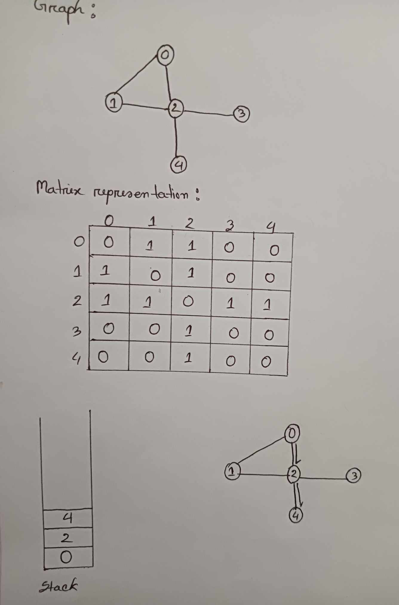
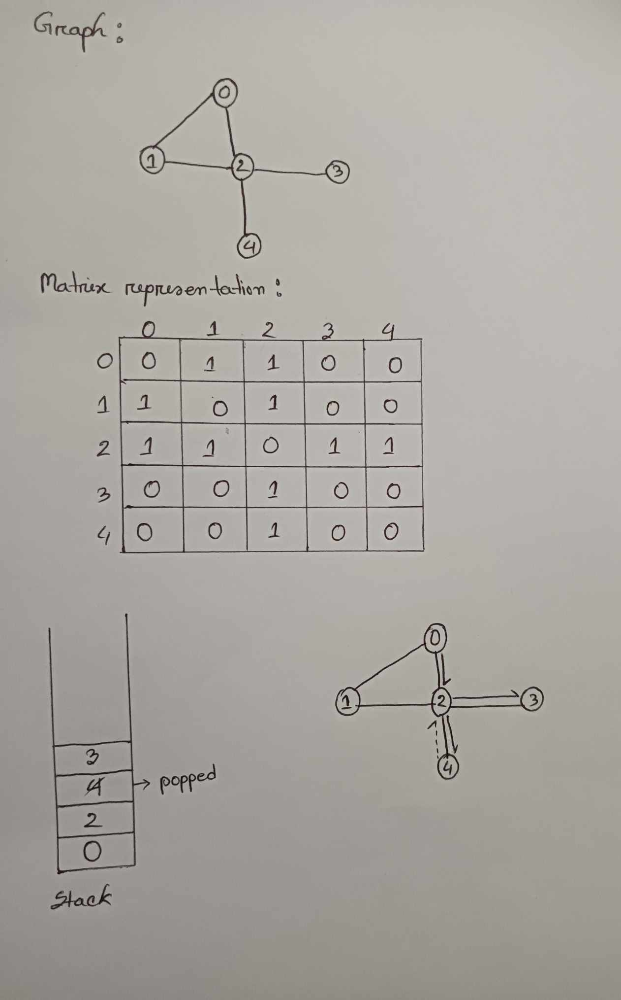

# DFS Algorithm and Steps 

### Depth First Search ( DFS ): Algorithm
* Take the adjacency matrix as input.
* Define a stack size as the total number of nodes.
* Select any node as the starting point of traversal and push it in the stack.
* Check if the node has any unvisited neighbour nodes. If so push it in the stack.
* Repeat step 4 untill there is no neighbour node of the node which is at the top of the stack.
* Pop the node from the top of the stack.
* Repeat step 4, 5 and 6 untill the stack is empty.
* When the stack is empty the whole graph is traversed.

### Depth First Search ( DFS ): Procedure

Let's consider the following graph to understand DFS traversal. 

Now we need to generate an input for the code. We can create an adjacency matrix from this graph.

## Step 1:
In this case we can start the traversal from node "0". We need to define a stack to track the nodes.

<ul>
  <li>First put the first node (in this case 0) to the stack. </li>
  <li>Then check if there are any adjacent nodes.</li>
</ul>

## Step 2:

We found 2 adjacent nodes here 1 and 2 . 

<ul>
  <li>Now push anyone of these nodes to the stack (Here node 2). </li>
  <li>Then check if there are any adjacent nodes of the current node (of node 2).</li>
</ul>

## Step 3:

Keep repeating this process untill there are no adjacent node of the current node.

<ul>
  <li>Here node "4" has no adjacent node. So we will pop it out of the stack to check the previous node.</li>
  <li>If the previous node has an adjacent node push it in the stack or pop the current node out of stack until any unvisited node is found</li>
</ul>

## Step 4:

Keep repating step 2 and step 3 until the stack is empty.

## Step 5:

Now the output is generated
And the DFS output starting from node "0" is: 0, 2, 4, 3, 1.

## Output of the Code:

## Git Bash Screenshot:

